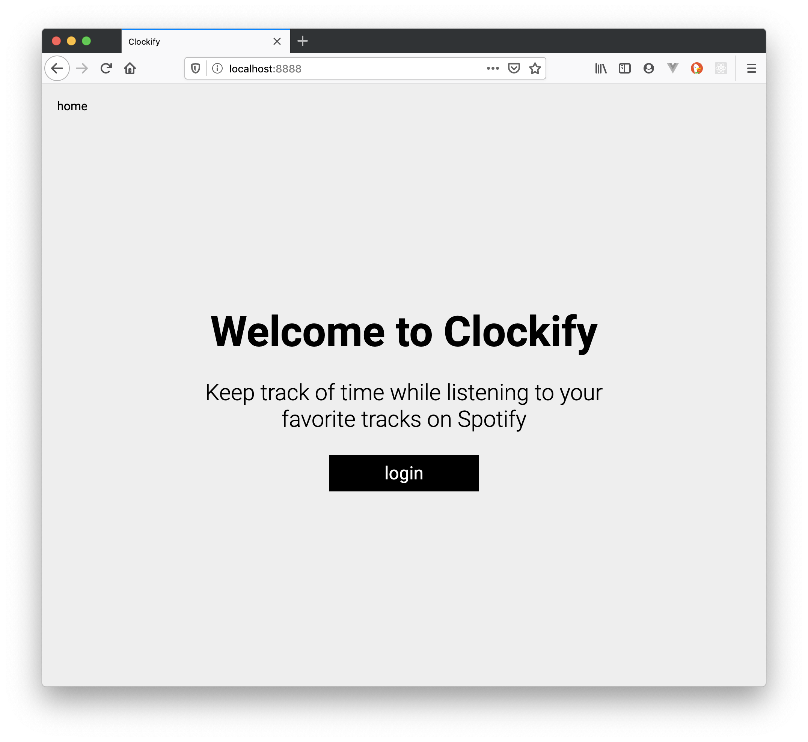

# Clockify

## About

This project contains the source files for a simple web service (`Clockify`) that generates and saves user-specific Spotify playlists with a given total length. In other words, you tell the service how long the playlist should be (in hours, minutes, and seconds), and a playlist with the name `clockify` will automagically appear in your private playlists, containing all your favourite songs.

This project is the result of a hackday as part of a fullstack developer course at `</salt>` in Stockholm. The setup for the initial commit was prepared in a private repo prior to the event.

## What it looks like

## Attribution

The `express` server is inspired by [Spotify's Web Auth Examples](https://github.com/spotify/web-api-auth-examples), although it has been altered heavily over the course of the project. See `LICENSE` for the original license.

## Get Started

Install the dependencies:

    npm i

Follow the [Spotify Web API](https://developer.spotify.com/documentation/general/guides/app-settings/#register-your-app) guide to register an application with Spotify. Also register the following route as a callback route for successful authentification:

    http://localhost:8888/callback/

Use the information obtained from Spotify to create a `.env` file in the root of this directory, replacing all placeholders in `.env.mock`. Also replace the `SESSION_SECRET` placeholder with a secret string (will be used by `express-session`).

Next, compile the TypeScript files:

    npm run build

Then start the development server:

    npm run dev

Happy hacking!
